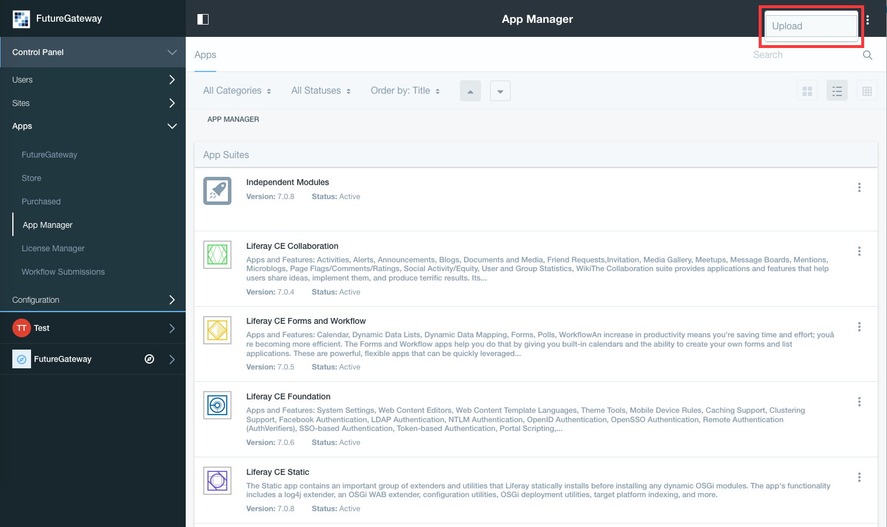
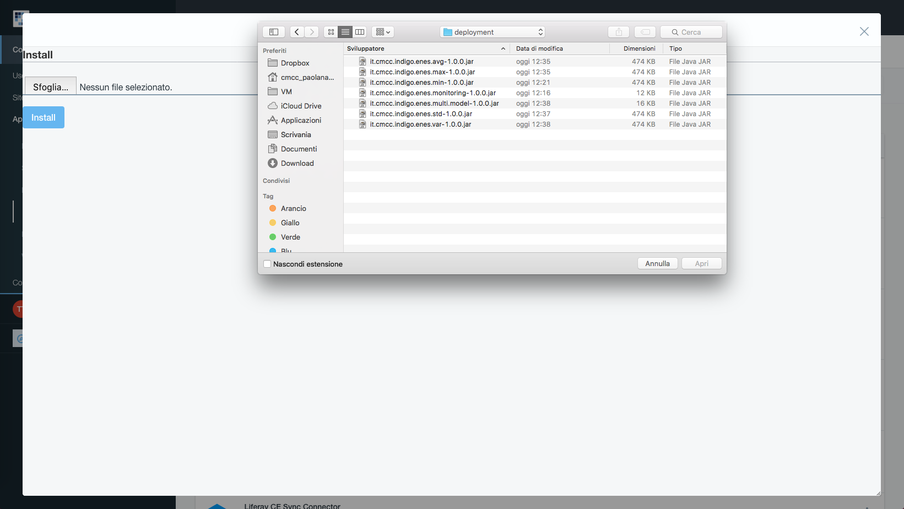
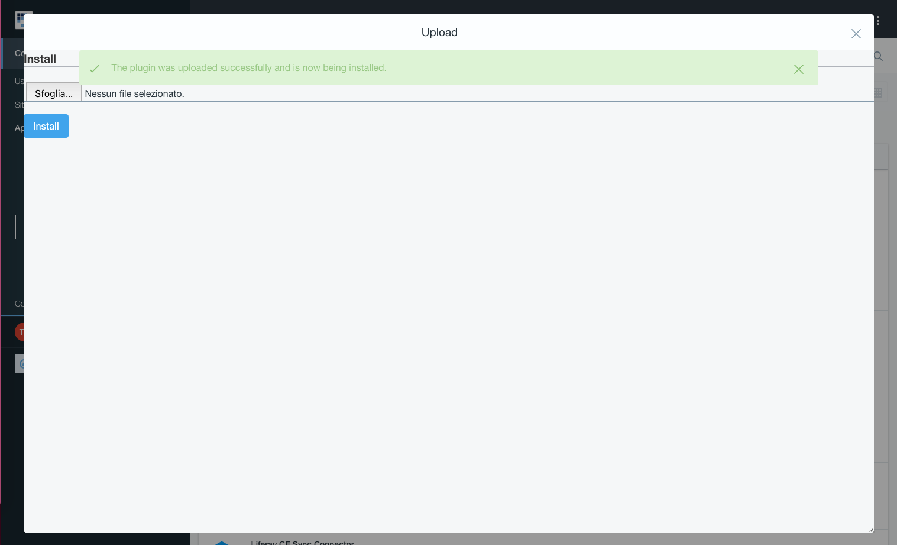
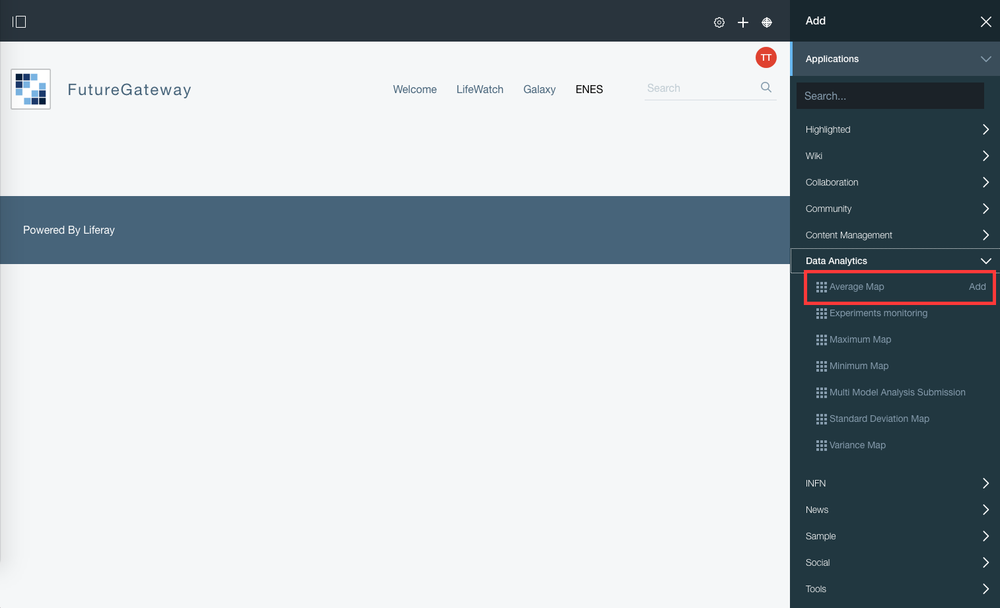

# Administration Guide

All the analytics portlets make use of the IAM token for user authentication and authorization. For this reason, the portal administrator should check that all the jars of the IAM authentication modules are deployed on the same Liferay portal.

# Deployment

To include the ENES analytics portlets in Liferay, the portal administrator has to deploy (upload) the following jar modules into the portal:
- it.cmcc.indigo.enes.multi.model-x.y.z.jar
- it.cmcc.indigo.enes.monitoring-x.y.z.jar
- it.cmcc.indigo.enes.avg-x.y.z.jar
- it.cmcc.indigo.enes.max-x.y.z.jar
- it.cmcc.indigo.enes.min-x.y.z.jar
- it.cmcc.indigo.enes.std-x.y.z.jar
- it.cmcc.indigo.enes.var-x.y.z.jar

The module upload page is available on the portal under `Liferay > Control Panel > Apps > App Manager`.

The administrator can select the file to upload from the local file system and click on the `Install` button. 

To include the modules, the administrator has to go to the ENES page and open the `Add` section (marked as a plus symbol on the top right side of the portal), open the `Application` menu, select the `Data Analytics` category and add the portlets to the page.

# Upgrade

To upgrade the portlets to a newer version, the system administrator has to replace the old jar files with the new ones into the `<liferay-installation-dir>/osgi/modules` folder and refresh the web portal.
