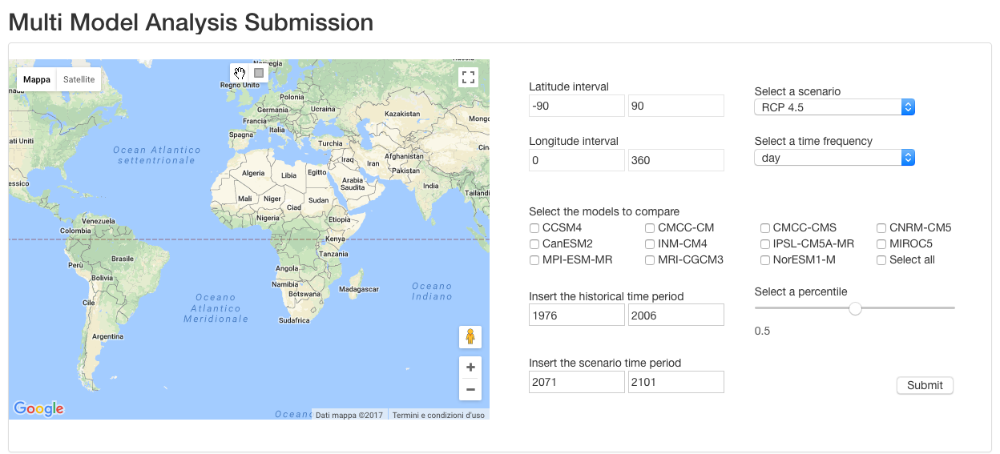
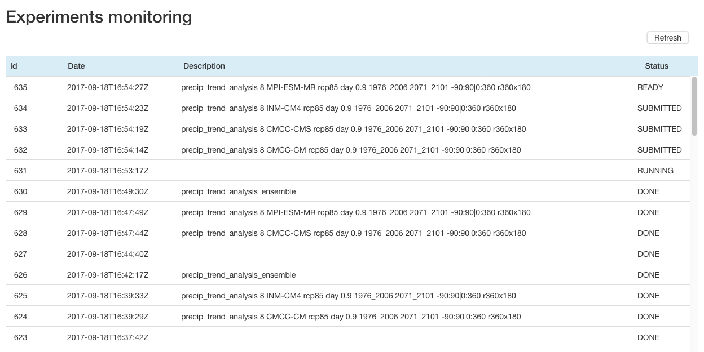
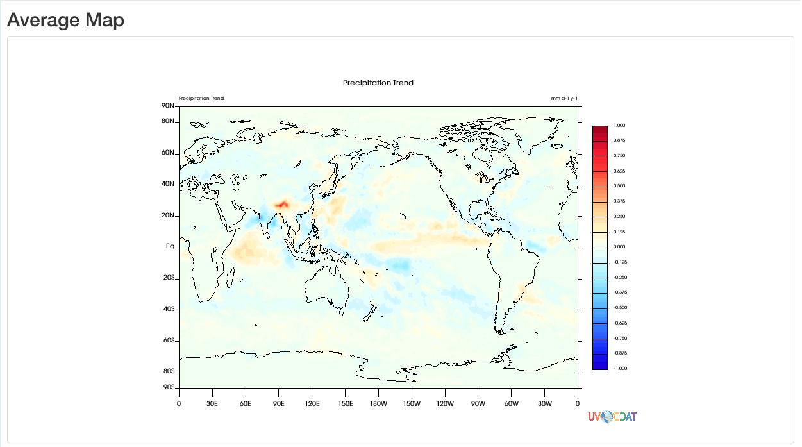
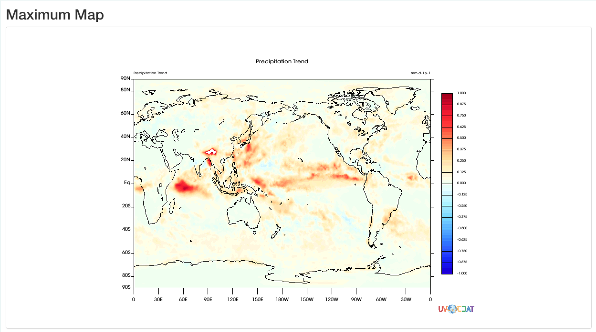
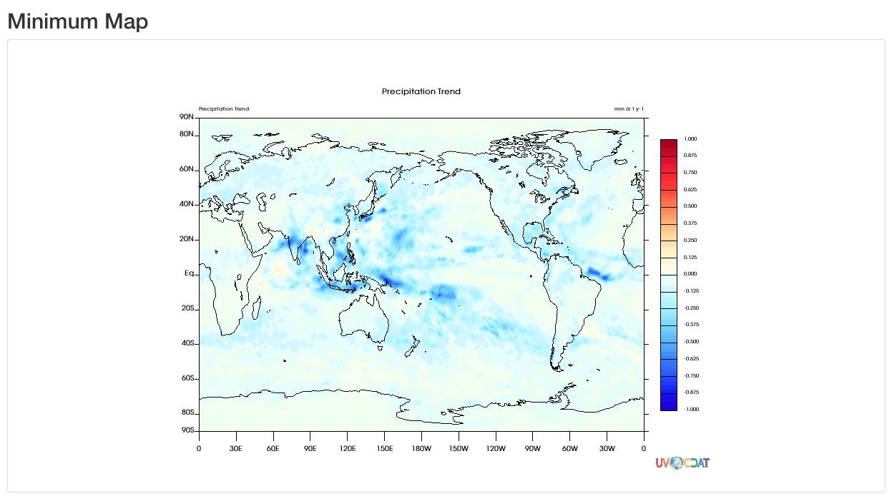
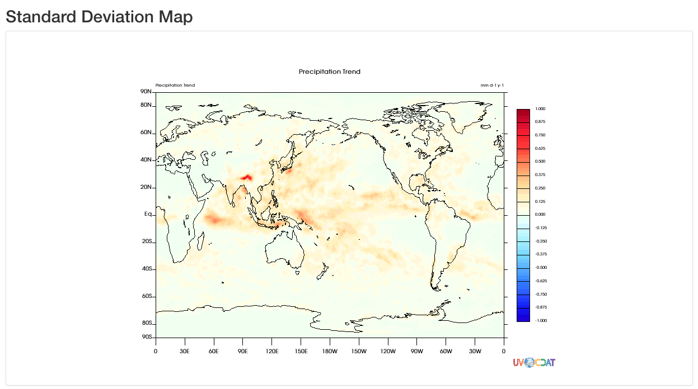
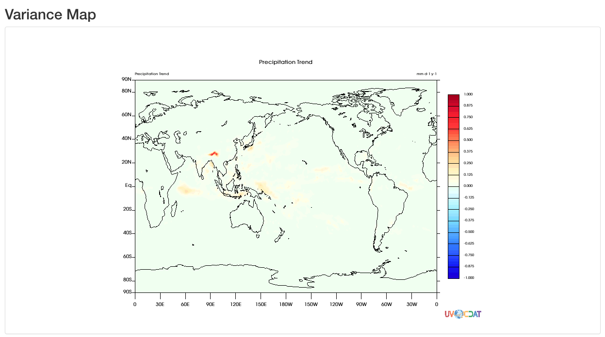

# User Guide

## data-analytics-multi-model-portlet

A precipitation trend analysis experiment can be easily submitted through this portlet which allows scientists to set a series of input arguments needed by the workflow to be executed.

To correctly execute the workflow experiment, the user can select two or more models to be considered in the experiment. The user has to select also a specific future scenario available for the different models, the time frequency, the spatial subset, the percentile and the temporal subset, both for the historical and the scenario time period. 

On the submission, a new task is created on the Future Gateway API service which will be responsible to forward the request to the Kepler-batch application and execute the multi-model workflow.

## data-analytics-monitoring-portlet

The Experiment Monitoring portlet allows the user to monitor the experiment submitted.

It consists of a table which lists the tasks executed through the Future Gateway engine. Each row describes a task submitted in terms of task ID, date and time of submission, summary of the parameters and current status of the execution.

The list of tasks visualised includes not only the one generated by the user but also the single-model subtasks gradually completed by the Ophidia nodes involved in the analysis. Finally, once the analysis is completed, the ensemble task is added to the list and the status switches on “DONE”, which means that the results are available for the visualisation.

## data-analytics-map-portlet

The output visualization portlets are responsible for containing the PNG images resulting from the precipitation trend analysis experiment.

These modules use the Future Gateway API service to get the information related to the ensemble task and needed to retrieve the path to those files. Several instances of the output portlets are instantiated, one for each PNG file generated by the analysis.

