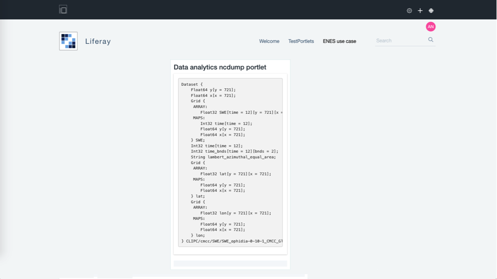

# User Guide

##data-analytics-multi-model-portlet

Once the portlet has been deployed and configured within the portal, it will show a form containing a set of fields through which it is possible to select the input parameters to submit to the Future Gateway to execute the experiment:
-	spatial subset
-	temporal subset
-	list of model to be compared
-	scenario
-	time frequency
-	percentile

##data-analytics-map-portlet

The portlet will visualize the png map produced by the execution of the experiment.

##data-analytics-ncdump-portlet

The portlet will visualize the nc-dump file.

